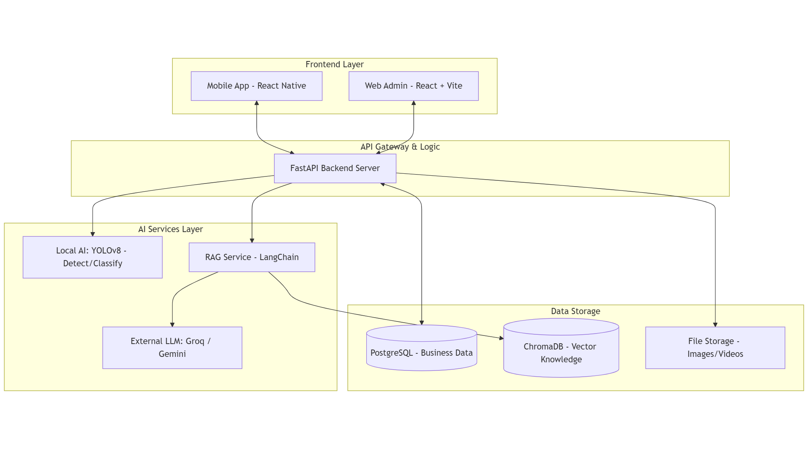

# 🐔 Chicken Disease System - Hệ Thống Giám Sát và Chẩn Đoán Bệnh Gia Cầm

Hệ thống ứng dụng Trí tuệ nhân tạo (AI) toàn diện nhằm hỗ trợ người chăn nuôi theo dõi sức khỏe đàn gà và chẩn đoán bệnh sớm thông qua hình ảnh phân và video giám sát chuồng trại.

---

## 🌟 Tổng Quan Dự Án
Dự án được xây dựng với mục tiêu chuyển đổi số trong nông nghiệp, giúp giảm thiểu rủi ro dịch bệnh và tối ưu hóa quy trình chẩn đoán cho người nông dân. Hệ thống kết hợp giữa công nghệ thị giác máy tính (Computer Vision) và xử lý ngôn ngữ tự nhiên (NLP/RAG) để đưa ra các tư vấn chuyên môn chính xác.

---

## 🏗️ Kiến Trúc Hệ Thống


Hệ thống bao gồm 4 thành phần chính:
1.  **Mobile App:** 📱 Ứng dụng React Native CLI dành cho người chăn nuôi.
2.  **Web Admin:** 💻 Trang quản trị React (MUI) dành cho kỹ thuật viên và bác sĩ thú y.
3.  **Backend API:** ⚙️ Hệ thống xử lý trung tâm FastAPI (Python).
4.  **AI Core:** 🧠 Mô hình YOLOv8 và Hệ thống RAG (Retrieval-Augmented Generation).

---

## 🚀 Các Tính Năng Chính

### 1. Giám Sát Đàn Gà (Detection)
*   Sử dụng mô hình **YOLOv8 Detection** để nhận diện gà khỏe và gà bệnh trong hình ảnh/video.
*   **Hiệu năng:** Độ chính xác **mAP@50 đạt 95%**.
*   **Xử lý Video:** Tự động đếm số lượng, gắn nhãn (Healthy/Sick) và tạo ảnh GIF preview kết quả.
*   Cảnh báo tức thì nếu phát hiện tỷ lệ gà bệnh vượt ngưỡng an toàn.

### 2. Chẩn Đoán Qua Phân (Classification)
*   Sử dụng mô hình **YOLOv8 Classification** để phân tích hình ảnh phân gà.
*   **Hiệu năng:** Độ chính xác **97.27% (Top-1 Accuracy)** trên bộ dữ liệu 8,069 ảnh.
*   Hỗ trợ nhận diện 4 loại trạng thái: `Healthy`, `Coccidiosis`, `New Castle Disease`, `Salmonella`.

### 3. Tư Vấn AI Chuyên Sâu (RAG System)
*   **Hệ thống RAG:** Kết hợp cơ sở dữ liệu chuyên môn với LLM (Gemini/Groq).
*   **Vector Database:** Sử dụng ChromaDB và Local Embeddings (`paraphrase-multilingual-MiniLM-L12-v2`) để tìm kiếm kiến thức chuyên môn.
*   **Tư vấn Phác đồ:** Trả lời các câu hỏi về triệu chứng, nguyên nhân và các bước điều trị chi tiết.

### 4. Quản Lý Hệ Thống (Admin)
*   **Knowledge Base:** Quản lý dữ liệu bệnh học, thuốc và quy trình phòng bệnh. Đồng bộ tự động sang Vector DB.
*   **AI Settings:** Cấu hình linh hoạt Provider (Gemini/Groq), API Keys (Write-only), Prompt và Temperature.
*   **Usage Tracking:** Theo dõi chi phí và số lượng token sử dụng theo thời gian thực.
*   **Diagnosis Logs:** Lưu trữ lịch sử chẩn đoán kèm ảnh thật để cải thiện mô hình.

---

## 📊 Hiệu Năng Mô Hình AI Chi Tiết

### Mô Hình Phát Hiện (Chicken Detection)
- **Model:** YOLOv8n (6.2 MB)
- **Precision/Recall:** ~95%
- **mAP@50:** 95%
- **Dữ liệu:** 3,175 ảnh

### Mô Hình Phân Loại (Fecal Classification)
- **Model:** YOLOv8n-cls
- **Accuracy:** 97.27%
- **Dữ liệu:** 8,069 ảnh

---

## 🛠️ Công Nghệ Sử Dụng

| Thành phần | Công nghệ |
| :--- | :--- |
| **Backend** | FastAPI, SQLAlchemy, Alembic, Pydantic |
| **Database** | PostgreSQL, ChromaDB (Vector DB) |
| **AI/ML** | Ultralytics YOLOv8, LangChain, HuggingFace Embeddings |
| **Frontend Web** | React 18, Vite, Material UI (MUI), Recharts |
| **Mobile App** | React Native CLI, React Navigation, Axios |
| **DevOps** | Docker, Docker Compose |

---

## 📁 Cấu Trúc Thư Mục
```text
D:\Chicken_Disease_System\
├── backend/                # FastAPI source code (Port 8000)
├── mobile_app/             # React Native CLI source code
├── web_admin/              # Vite + React source code (Port 5173)
├── ai_model/               # Notebooks và dữ liệu huấn luyện YOLO
└── docker-compose.yml      # Orchestration (PostgreSQL, ChromaDB 8001)
```

---

## ⚙️ Cài Đặt và Vận Hành

### 1. Yêu Cầu Hệ Thống
*   Docker & Docker Compose.
*   Node.js >= 20 & Yarn/NPM.
*   Android Studio / Xcode (cho Mobile App).
*   Google API Key (Gemini) hoặc Groq API Key.

### 2. Backend & Database (Docker)
1.  **Cấu hình môi trường:** Tạo file `backend/.env` từ `backend/.env.example`.
2.  **Khởi động:**
    ```bash
    docker-compose up --build -d
    ```
3.  **API Docs:** Truy cập `http://localhost:8000/docs` (Swagger UI).

### 3. Web Admin
```bash
cd web_admin
npm install
npm run dev
```

### 4. Mobile App (React Native CLI)
```bash
cd mobile_app
npm install
# Khởi động Metro Bundler
npx react-native start
# Chạy trên Android/iOS (mở tab mới)
npx react-native run-android
# npx react-native run-ios
```

---

---

### Tài Khoản Mặc Định
*   **Admin:** `admin@gmail.com` / `admin123`

---
**Chicken Disease System** - *Vì một nền chăn nuôi bền vững và thông minh.* 🐔🚀
