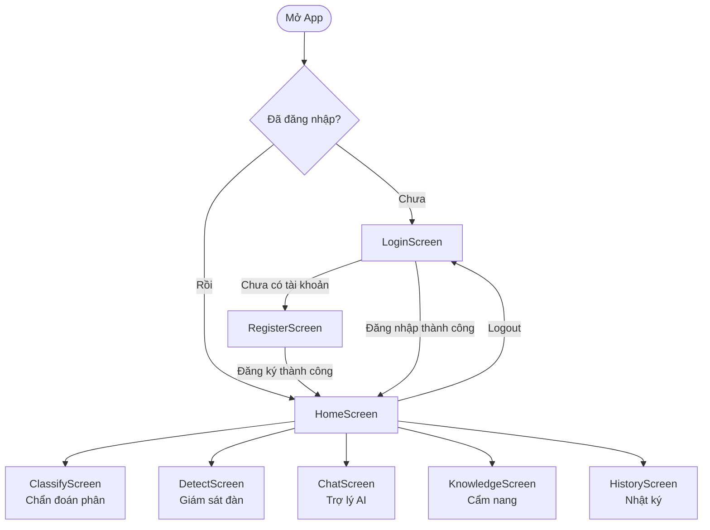
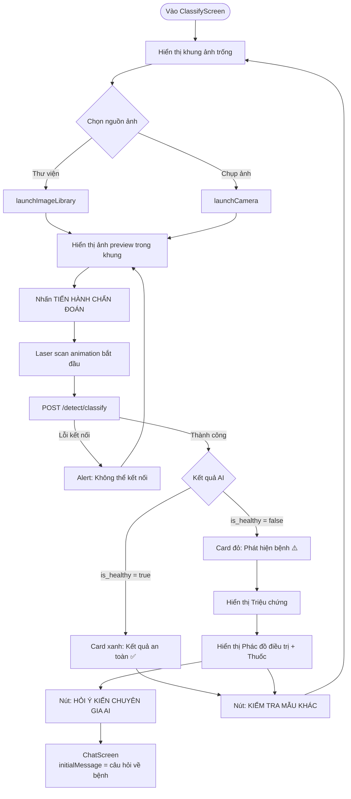
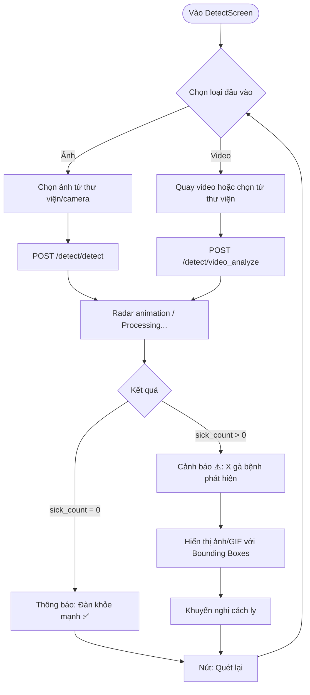
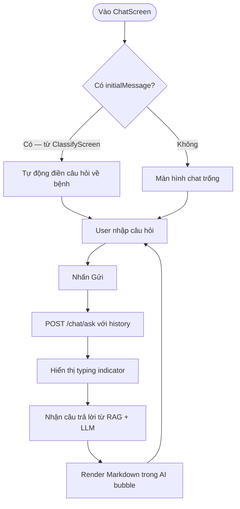
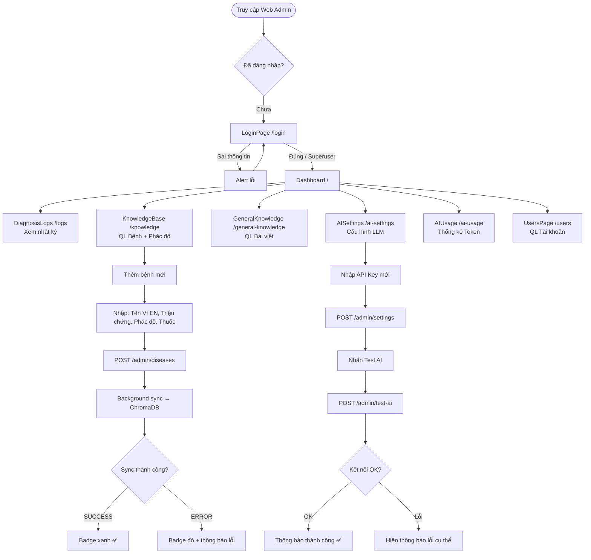
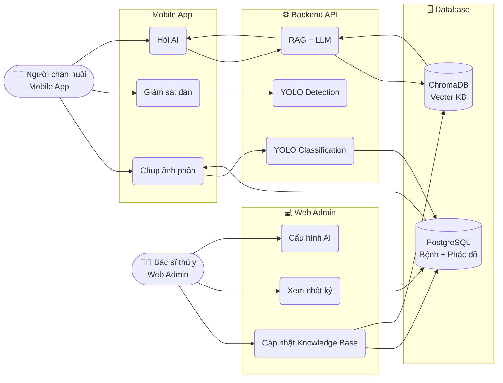

# 🎨 Đặc Tả Giao Diện UI/UX — Chicken Disease System

## 1. Tổng Quan Design System

Hệ thống gồm **2 nền tảng giao diện** với chung một bộ màu sắc và ngôn ngữ thiết kế nhất quán, hướng đến đối tượng là người chăn nuôi tại nông thôn Việt Nam.

| Nền tảng | Stack | Cổng | Mục tiêu người dùng |
|:---|:---|:---|:---|
| **Web Admin** | React 18 + Vite + Material UI (MUI) | `5173` | Bác sĩ thú y, Quản trị viên |
| **Mobile App** | React Native CLI 0.83 | Android/iOS | Người chăn nuôi |

---

## 2. Bộ Màu Sắc (Color Palette)

> **Triết lý thiết kế:** Màu xanh lá nông nghiệp (`#2e7d32`) xuyên suốt cả 2 nền tảng, tạo sự nhận diện thương hiệu thống nhất và phù hợp với chủ đề nông nghiệp.

| Tên | Hex | Vai trò |
|:---|:---|:---|
| **Primary Green** | `#2e7d32` | Màu chủ đạo (Header, Buttons, Accent) |
| **Dark Green** | `#1B5E20` / `#005005` | Tiêu đề, gradient tối |
| **Light Green** | `#60ad5e` | Hover state, badge background |
| **Alert Orange** | `#f57c00` | Cảnh báo bệnh, Secondary color |
| **Success Green** | `#00c853` | Kết quả khỏe mạnh |
| **Background** | `#F4F6F8` (Web) / `#F8F9FA` (Mobile) | Nền trang tổng thể |
| **Surface White** | `#FFFFFF` | Card, Dialog, Input |
| **Text Primary** | `#212B36` | Nội dung chính |
| **Text Secondary** | `#637381` | Mô tả, label phụ |
| **Divider** | `rgba(145,158,171,0.24)` | Đường phân cách |
| **Error Red** | `#FF5252` | Kết quả phát hiện bệnh |
| **Healthy Badge** | `#E8F5E9` | Badge trạng thái khỏe |

---

## 3. Typography

### Web Admin (MUI)
| Variant | Font | Weight | Size |
|:---|:---|:---|:---|
| Font Family | `"Public Sans", "Inter", "Roboto", sans-serif` | — | — |
| `h4` (Page Title) | Public Sans | 700 | 1.5rem |
| `h5` (Section Title) | Public Sans | 700 | 1.25rem |
| `h6` (Card Title) | Public Sans | 700 | 1rem (18px) |
| `body1` | Public Sans | 400 | line-height 1.5 |
| `button` | Public Sans | 700 | `textTransform: none` |
| `overline` | Public Sans | 700 | letter-spacing: 1 |

### Mobile App (React Native)
| Phần tử | Weight | Size | Ghi chú |
|:---|:---|:---|:---|
| Tên người dùng (Header) | 900 | 24px | Letter-spacing -0.5 |
| Card Title | bold | 16px | — |
| Section Title | 900 | 18px | Letter-spacing -0.5 |
| Card Subtitle | 400 | 13px | Color `#78909C` |
| Label nút (ALL CAPS) | bold | 15px | Letter-spacing 0.5 |

---

## 4. Spacing & Shape

| Thuộc tính | Web Admin | Mobile App |
|:---|:---|:---|
| Border Radius (Card) | `16px` | 20–28px |
| Border Radius (Button) | `8px` | `18px` |
| Border Radius (Input) | `8px` | — |
| Border Radius (Header) | — | 32px (bottom corners) |
| Card Padding | `24px` | `16–20px` |
| Card Shadow | `0 0 2px rgba(...), 0 12px 24px -4px rgba(...)` | `elevation: 3-10` |

---

## 5. Platform A — Web Admin

### 5.1. Kiến Trúc Navigation

```
/login                   → LoginPage (Public)
/                        → Dashboard (Protected)
/logs                    → DiagnosisLogs (Protected)
/knowledge               → KnowledgeBase - Quản lý bệnh (Protected)
/general-knowledge       → GeneralKnowledge - Bài viết (Protected)
/ai-settings             → AISettings - Cấu hình LLM (Protected)
/ai-usage                → AIUsage - Thống kê token (Protected)
/users                   → UsersPage - Quản lý tài khoản (Protected)
```

**Auth Guard:** `ProtectedRoute` component — kiểm tra `isAuthenticated` từ `AuthContext`. Nếu chưa đăng nhập → redirect về `/login`.

---

### 5.2. Layout Chung (MainLayout)

Giao diện theo chuẩn **Sidebar + Content Area**:
- **Sidebar (trái):** Logo thương hiệu, danh sách menu điều hướng, avatar Admin.
- **Content Area (phải):** Hiển thị trang được chọn, nền `#F4F6F8`.
- **Responsive:** Sidebar ẩn thành icon trên màn nhỏ.

---

### 5.3. Trang: Login (`/login`)

| Thành phần | Mô tả |
|:---|:---|
| Layout | Full-screen, căn giữa, nền gradient xanh lá |
| Logo | Biểu tượng hệ thống + tên ứng dụng |
| Form | Card trắng nổi, input Email, input Password |
| Button | `LOGIN` — màu primary, full-width, height 48px |
| State | Loading spinner khi đang đăng nhập |
| Error | MUI Alert màu đỏ khi sai thông tin |

---

### 5.4. Trang: Dashboard (`/`)

Là trang quan trọng nhất, hiển thị toàn bộ dữ liệu giám sát thời gian thực.

#### Thẻ Thống Kê (4 Thẻ Gradient)
Được chia thành 4 cột (responsive xuống 2 cột trên tablet):

| Thẻ | Màu Gradient | Icon | Dữ liệu |
|:---|:---|:---|:---|
| LƯỢT CHẨN ĐOÁN | `#2e7d32 → #1b5e20` | `Assessment` | `total_diagnosis` |
| CẢNH BÁO BỆNH | `#f57c00 → #e65100` | `BugReport` | `sick_cases` |
| MẪU PHÂN TÍCH | `#00c853 → #009624` | `HealthAndSafety` | `total_fecal_analysis` |
| GIÁM SÁT ĐÀN | `#0288d1 → #01579b` | `Pets` | `total_detections` |

**Hiệu ứng hover:** `translateY(-4px)` + tăng shadow khi di chuột vào thẻ.
**Decorative:** Vòng tròn gradient mờ ở góc dưới phải mỗi thẻ.

#### Biểu Đồ Xu Hướng (Full Width)
- **Loại:** `ComposedChart` (Recharts) — kết hợp Area + Bar.
- **Dữ liệu:** 7 ngày gần nhất.
- **Area (xanh):** Tổng lượt khám với gradient fill mờ dần.
- **Bar (cam):** Số ca bệnh, border-radius top `[4,4,0,0]`, bar size 30px.
- **Tooltip:** Border-radius 12px, không có border, shadow mềm.

#### Biểu Đồ Phân Bổ (Full Width)
- **Loại:** `PieChart` Donut — innerRadius 100px, outerRadius 140px.
- **Số tổng:** Hiển thị overlay ở giữa vòng donut.
- **Chú thích:** Tùy chỉnh bên phải, dòng màu hình vuông bo tròn.
- **Palette:** `['#2e7d32', '#f57c00', '#00c853', '#ffa000', '#009624', '#ff6f00']`.

---

### 5.5. Trang: Nhật Ký Chẩn Đoán (`/logs`)

| Thành phần | Mô tả |
|:---|:---|
| Dữ liệu | Bảng MUI Table, phân trang, hiển thị ảnh thumbnail thật |
| Cột | Ảnh, Loại (Phân/Hành vi), Kết quả AI, Độ tin cậy, Thời gian, Trạng thái |
| Chip trạng thái | Xanh lá = Bình thường, Đỏ cam = Phát hiện bệnh |
| Table Header | Nền `#F4F6F8`, chữ đậm màu `#637381` |
| Table Row Border | Dashed border-bottom |

---

### 5.6. Trang: Quản Lý Bệnh - Knowledge Base (`/knowledge`)

Trang phức tạp nhất của Web Admin.

| Thành phần | Mô tả |
|:---|:---|
| Danh sách | Cards/Accordion bên trái, chọn bệnh → hiện chi tiết |
| Form thêm/sửa | Dialog/Drawer với đầy đủ trường: Tên VI, Tên EN, Triệu chứng, Nguyên nhân, Phòng bệnh |
| Phác đồ điều trị | Thêm/xóa các bước theo thứ tự, mỗi bước có danh sách thuốc |
| Thuốc | Inline form: Tên thuốc, Hoạt chất, Nhà SX, Liều dùng |
| ChromaDB Sync | Badge trạng thái `PENDING/SUCCESS/ERROR` hiển thị trên mỗi bệnh |
| Action bar | Nút Lưu (primary) + Xóa (error color) |

---

### 5.7. Trang: Kiến Thức Chung (`/general-knowledge`)

| Thành phần | Mô tả |
|:---|:---|
| Danh sách | Bảng bài viết: Danh mục, Tiêu đề, Ngày tạo, Trạng thái sync, Hành động |
| Form thêm/sửa | Dialog: Danh mục (dropdown), Tiêu đề, Nội dung (Textarea nhiều dòng), Nguồn |
| Phân loại | Chip màu theo danh mục: Chuồng trại, Dinh dưỡng, Vệ sinh... |

---

### 5.8. Trang: Cấu Hình AI (`/ai-settings`)

Trang nhạy cảm, áp dụng chuẩn **Write-Only** cho API keys.

| Thành phần | Mô tả |
|:---|:---|
| Provider Selector | Radio hoặc Tabs: Gemini / Groq |
| API Key Input | Luôn hiển thị `********`, người dùng nhập mới để thay |
| Model Name | Input text tên model (VD: `gemini-1.5-flash`) |
| Temperature | Slider hoặc Input số từ 0.0 → 1.0 |
| System Prompt | Textarea lớn, đa dòng |
| Nút Test AI | POST `/admin/test-ai` → hiển thị kết quả kết nối |
| Nút Lưu | POST `/admin/settings` → save từng key |

---

### 5.9. Trang: Thống Kê Sử Dụng AI (`/ai-usage`)

| Thành phần | Mô tả |
|:---|:---|
| KPI Cards | Tổng Requests, Tổng Tokens |
| Biểu đồ xu hướng | BarChart: Requests + Tokens theo ngày (7 ngày) |
| Biểu đồ phân bổ | PieChart: Tỷ lệ sử dụng theo tính năng (chat/classification/detection) |

---

### 5.10. Trang: Quản Lý Người Dùng (`/users`)

| Thành phần | Mô tả |
|:---|:---|
| Bảng danh sách | Tên, Email, SĐT, Vai trò (Chip), Ngày tạo, Hành động |
| Vai trò Chip | `farmer` = xanh lá, `vet` = xanh dương, `admin` = tím |
| Form thêm | Dialog: Tên, Email, Mật khẩu, Vai trò |
| Form sửa | Dialog inline, không cho sửa mật khẩu trực tiếp |

---

## 6. Platform B — Mobile App

### 6.1. Kiến Trúc Navigation

Dùng **React Navigation Stack** — điều hướng theo lớp (stack-based), không có tab bar:

```
Chưa đăng nhập:
  → LoginScreen
  → RegisterScreen

Đã đăng nhập:
  → HomeScreen (gốc)
    ├── ClassifyScreen   (Chẩn đoán phân)
    ├── DetectScreen     (Giám sát đàn)
    ├── ChatScreen       (Trợ lý AI)
    ├── KnowledgeScreen  (Cẩm nang)
    └── HistoryScreen    (Nhật ký)
```

**Auth Guard:** Conditional rendering trong `AppNavigator` dựa trên `user` từ `AuthContext`. Loading state hiển thị `ActivityIndicator` màu `#2e7d32`.

---

### 6.2. Design Header Chung (CustomHeader)

Header tùy chỉnh cao cấp, áp dụng cho tất cả màn hình con:
- Nền trắng với `elevation` và shadow mềm.
- Tiêu đề đậm (fontWeight 900) + subtitle nhỏ mô tả chức năng.
- Nút Back ở trái (icon mũi tên).
- Slot `rightComponent` tùy chỉnh (icon trang định danh).

---

### 6.3. Màn Hình: Login

| Thành phần | Mô tả |
|:---|:---|
| Nền | Gradient: `#1B5E20 → #2e7d32 → #388E3C` |
| Logo | Icon gà/nông nghiệp + tên hệ thống |
| Form | Card trắng nổi, border-radius 24px |
| Input | Email/SĐT + Mật khẩu (ẩn/hiện) |
| Nút đăng nhập | Gradient xanh lá, border-radius 16px, full-width |
| Link | Chuyển sang màn hình Đăng ký |

---

### 6.4. Màn Hình: Register

| Thành phần | Mô tả |
|:---|:---|
| Fields | Họ tên, Số điện thoại (bắt buộc), Email (tùy chọn), Mật khẩu, Xác nhận mật khẩu |
| Validation | Kiểm tra SĐT tồn tại + mật khẩu khớp nhau trước khi gửi |
| Hành vi | Tự động đăng nhập sau khi đăng ký thành công (không redirect login) |

---

### 6.5. Màn Hình: Home (Trang Chủ)

**Phần quan trọng nhất** của ứng dụng. Bố cục 2 vùng:

#### Header Section (Nền xanh #2e7d32)
- **Chào hỏi:** "Xin chào, [Tên người dùng]" + nút Logout góc phải.
- **Weather Card:** Card trắng nổi (float), hiển thị thời tiết thực tế (OpenWeather API):
  - Nhiệt độ (badge xanh lá), độ ẩm, mô tả thời tiết.
  - Icon và màu sắc động theo mức cảnh báo (bình thường/nóng/lạnh/mưa...).
  - Nút refresh để tải lại.
  - Khi lỗi mạng: hiển thị icon `cloud-off-outline` with thông báo rõ ràng.
- Header bo tròn góc dưới (borderBottomLeftRadius/borderBottomRightRadius: 32px).

#### Body Section (Nền #F8F9FA)
Lưới menu (list dọc, mỗi thẻ full-width):

| Tính năng | Icon | Màu trái | Màu nền icon |
|:---|:---|:---|:---|
| Giám sát đàn | `radar` | `#2e7d32` | `#E8F5E9` |
| Chẩn đoán phân | `microscope` | `#388E3C` | `#F1F8E9` |
| Trợ lý ảo AI | `robot-confused-outline` | `#f57c00` | `#FFF3E0` |
| Cẩm nang | `book-open-page-variant` | `#689F38` | `#F9FBE7` |
| Nhật ký | `history` | `#455A64` | `#ECEFF1` |

**Thiết kế Card Menu:** Nền trắng, `borderLeftWidth: 4` với màu tương ứng, border-radius 20px, shadow mềm.

---

### 6.6. Màn Hình: Classify (Chẩn Đoán Phân)

Màn hình kỹ thuật cao nhất với nhiều hiệu ứng animation.

#### Luồng trải nghiệm:
```
1. [Khung ảnh vuông] Placeholder "Chưa có mẫu vật" với icon medical-bag
        ↓ User chọn nguồn
2. Picker: [Thư viện] [Chụp mẫu] (icon camera + gallery)
        ↓ Ảnh được chọn
3. [Ảnh hiển thị trong khung] + Nút [TIẾN HÀNH CHẨN ĐOÁN]
        ↓ AI đang phân tích
4. Animation: Laser xanh neon (#00E676) quét từ trên xuống (loop)
        ↓ Có kết quả
5. Kết quả chẩn đoán (animate fade-in + slide-up từ dưới)
```

#### Vùng Kết Quả (Animated):
- **Result Tag:** Badge góc trên phải khung ảnh — Xanh "BÌNH THƯỜNG" hoặc Đỏ "PHÁT HIỆN BỆNH".
- **Diagnosis Card:** Tên bệnh (VI + EN), vòng tròn độ chính xác (%).
- **Triệu chứng:** Text block nền `#F1F8E9`.
- **Phác đồ điều trị:** Card với header xanh, timeline dọc (step circle + vertical line), thuốc hiển thị dạng pills (`#F1F8E9`).
- **CTA Button:** "HỎI Ý KIẾN CHUYÊN GIA AI" → navigate đến ChatScreen với `initialMessage` tự động điền.
- **Kết quả khỏe mạnh:** Card xanh lá nhạt với icon check-decagram lớn.

---

### 6.7. Màn Hình: Detect (Giám Sát Đàn)

Màn hình phân tích video/ảnh đàn gà bằng YOLOv8 Detection.

| Thành phần | Mô tả |
|:---|:---|
| Input | Chọn ảnh hoặc quay video từ camera/thư viện |
| Giao diện giống Radar | Hiệu ứng radar animation trong khi xử lý |
| Kết quả | Số gà khỏe / số gà bệnh, tổng số, tỷ lệ % |
| Cảnh báo | Banner đỏ cam nếu phát hiện gà bệnh > 0 |
| Ảnh annotated | Ảnh/GIF kết quả với bounding boxes |
| Cách ly khuyến nghị | Hiển thị khi có gà bệnh |

---

### 6.8. Màn Hình: Chat (Trợ Lý AI)

| Thành phần | Mô tả |
|:---|:---|
| Layout | Chat bubble style, cuộn dọc |
| Tin nhắn User | Bubble xanh lá bên phải |
| Tin nhắn AI | Bubble xám nhạt bên trái, hỗ trợ **Markdown rendering** (`react-native-markdown-display`) |
| `initialMessage` | Nếu đến từ ClassifyScreen, tự động điền câu hỏi về bệnh vừa phát hiện |
| Input | TextInput + nút gửi màu xanh lá |
| Loading | `ActivityIndicator` hoặc "đang nhập..." placeholder |
| Header | CustomHeader "Trợ lý Thú y AI" |

---

### 6.9. Màn Hình: Knowledge (Cẩm Nang)

| Thành phần | Mô tả |
|:---|:---|
| Danh sách | FlatList các bài viết kiến thức chung từ API |
| Card bài viết | Icon danh mục + Tiêu đề + đoạn trích nội dung |
| Màu danh mục | Chip màu theo category |
| Detail view | Mở rộng inline hoặc màn hình mới |

---

### 6.10. Màn Hình: History (Nhật Ký)

| Thành phần | Mô tả |
|:---|:---|
| Danh sách | Timeline kết hợp cả chẩn đoán phân + giám sát đàn |
| Sắp xếp | Mới nhất lên trên |
| Card item | Ảnh thumbnail nhỏ thật, loại scan, kết quả, ngày giờ |
| Chip trạng thái | Xanh "Healthy" / Đỏ "Sick" |
| Chi tiết | Tap vào xem đầy đủ thông tin bệnh và phác đồ |

---

## 7. Hiệu Ứng Chuyển Động (Animations)

### Web Admin
| Hiệu ứng | Áp dụng tại | Kỹ thuật |
|:---|:---|:---|
| Card hover lift | Stat Cards (Dashboard) | `transition: all 0.3s cubic-bezier(0.4,0,0.2,1)`, `translateY(-4px)` |
| Chart tooltip | Recharts Tooltip | Custom rounded shadow |

### Mobile App
| Hiệu ứng | Áp dụng tại | Kỹ thuật |
|:---|:---|:---|
| Laser scan | ClassifyScreen (khi loading) | `Animated.loop` + `Easing.linear`, translateY 0→300px |
| Kết quả fade-in | ClassifyScreen (sau khi có result) | `Animated.parallel`: `Animated.timing(fadeAnim)` + `Animated.spring(slideUpAnim)` |
| Button press | ClassifyScreen (btnMain) | `scale: 0.96` khi `pressed` |
| Loading spinner | AppNavigator, mọi màn hình | `ActivityIndicator` màu `#2e7d32` |

---

## 8. Nguyên Tắc UX Quan Trọng

1. **Ngôn ngữ:** Toàn bộ giao diện bằng **Tiếng Việt** — hướng đến người dùng nông thôn, không yêu cầu biết tiếng Anh.
2. **Offline-first data:** Thông tin thời tiết có fallback rõ ràng khi mất mạng, không hiển thị số ảo.
3. **Write-Only API Keys:** API Keys không bao giờ được hiển thị sau khi lưu — đây là tính năng bảo mật chủ động.
4. **Deep Link giữa màn hình:** ClassifyScreen → ChatScreen tự động điền câu hỏi, giảm bước nhồi nhét cho người dùng.
5. **Feedback tức thì:** Mọi action đều có loading state rõ ràng, không để người dùng chờ không biết trạng thái.
6. **ChromaDB Sync Badge:** Mọi bài viết/bệnh đều có badge `PENDING/SUCCESS/ERROR` để Admin biết trạng thái vector DB.
7. **Tái đào tạo mô hình:** `verified_result` và `is_correct` trong `diagnosis_logs` dùng để bác sĩ thú y xác nhận kết quả → làm dataset cho fine-tuning.

---

## 9. Icon Library

| Nền tảng | Library | Prefix |
|:---|:---|:---|
| Web Admin | `@mui/icons-material` | Tên component (vd: `Assessment`, `BugReport`) |
| Mobile App | `react-native-vector-icons/MaterialCommunityIcons` | Tên string (vd: `microscope`, `radar`, `robot-confused-outline`) |

---

## 10. Luồng Tương Tác Người Dùng (User Interaction Flows)

### 10.1. Luồng Chính — Mobile App



---

### 10.2. Luồng Chẩn Đoán Phân (ClassifyScreen) — Chi tiết



---

### 10.3. Luồng Giám Sát Đàn (DetectScreen) — Chi tiết



---

### 10.4. Luồng Chat AI (ChatScreen) — Chi tiết



---

### 10.5. Luồng Tương Tác — Web Admin



---

### 10.6. Luồng Tổng Thể Hệ Thống (End-to-End)



---

*Cập nhật lần cuối: 28/02/2026*
